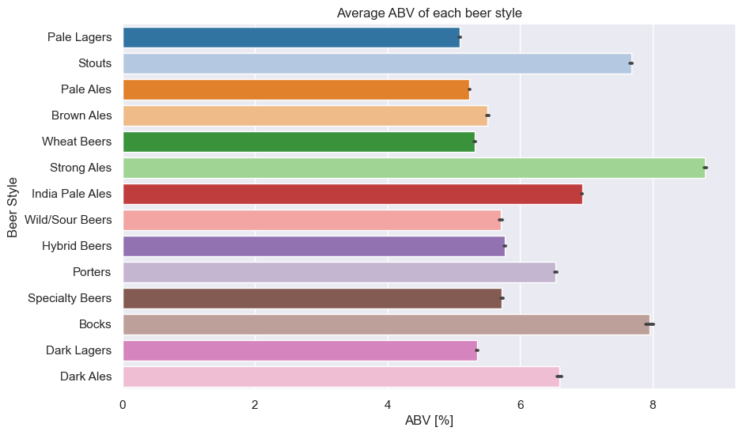
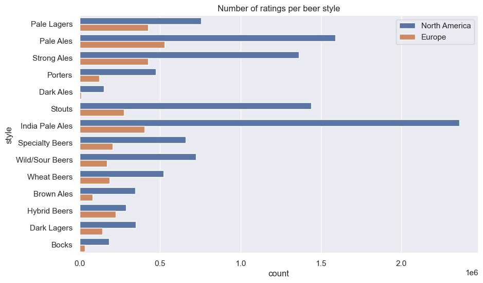
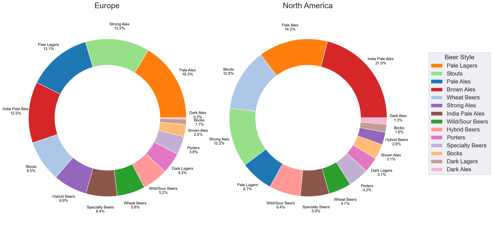

# Beer Styles

---

There are many specific beer styles, each with different alcohol content!

Let's group them by general style and explore how they are related to European and Northern American reviewers, as well as to how we can link this with general ABV preferences for those regions!

> _We clearly see that some beer styles are significantly stronger than others on average. If these styles are consumed more frequently on one of the two continents compared to the other, this could explain some differences in the way ratings are correlated with ABV._

Therefore let us consider how many reviews each style has on each of the regions:

> _There are far more American users in total, surpassing Europeans in each and every beer style, but the numbers already hint at different distributions and hence preferences for both continents. Let us take a look then at the relative distribution of the beer styles in each region._

> _This is getting interesting now! We see clear differences in preferences between Europe and Northern America. Some of the most rated beers show quite different percentage of the overall composition, most notably IPA's and Pale Lagers. Interestingly, in combination with the average ABV per beer we observe that North America has a clear tendency to prefer stronger beer styles in their mix than Europeans, so this hints strongly on why North America shows a higher ABV on average than Europe! Furthermore, this likely will impact seasonal patterns as well, since if strongly seasonal beers are more popular on one continent than the other, the effect of seasonality can be amplified by this!_ 

---

Americans seem to be huge fans of beer styles with high alcohol content (above 6%), such as **Stouts, Strong Ales, India Pale Ale, Porters, Bocks,** and **Dark Ales**. This is evident from the number of ratings, as well as the high average rating. **Strong Ales, Stouts,** and **India Pale Ale** have an average rating greater than 3.5, and the number of ratings for these beer styles is double, or even 4-5 times greater than the number of ratings Europeans submitted.
