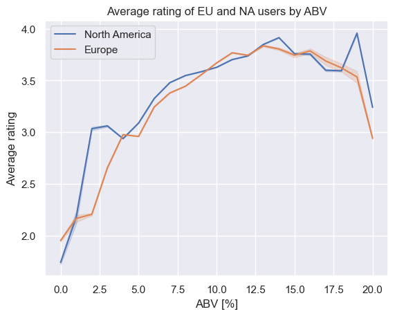

# Naive analysis
Moving straightforward to our research question:

**Do Americans prefer beers with higher alcohol content (ABV) than Europeans?**

--->We investigate the average rating that EU and NA users give, for each ABV rounded percentage.

- _It seems like NA tend to give better ratings in general_
- _All ratings are higher for beers with higher ABV_

Does the number of ratings per rounded ABV percentage has to do something with the average rating per ABV?
#### **TODO: decide wether we plot both separately or merged, and if we cut the ABV to 20%**
_Beers with ABV lower than 5% or greater than 15% have fewer number of ratings. If only few users rated, and graded them good, this results in better average rating for the specific ABV._

Is there a correlation between preference and a specific beer style, known for higher ABV?

Let's investigate this question:
[Beer styles](Beer%20styles.md)
