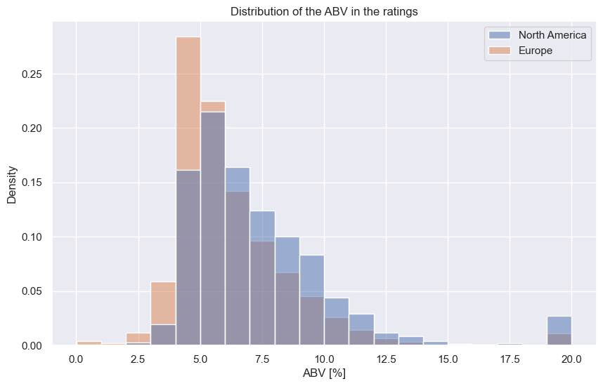

# Naive Analysis

Moving straightforward to our research question.

## Do Americans prefer beers with higher alcohol content (ABV) than Europeans?

We investigate the average rating that EU and NA users give for each ABV rounded percentage.

- **Observation:**
  - It seems like NA users tend to give better ratings in general, but we don't see a large difference.
  - Ratings are higher for beers with higher ABV to a certain point (15%), but then drop for both continents.

We also want to investigate if the number of ratings per rounded ABV percentage has to do something with the average rating per ABV?

> **Insight:**
> Beers with ABV lower than 5% or greater than 15% have fewer numbers of ratings. If only a few users rated and graded them well, this results in a better average rating for the specific ABV.

Another question arises out of curiosity:

### Is there a correlation between preference and a specific beer style known for higher ABV?

Let's investigate this question: [Beer Styles](/ada-welovepandas-webpage/Beer%20styles)
