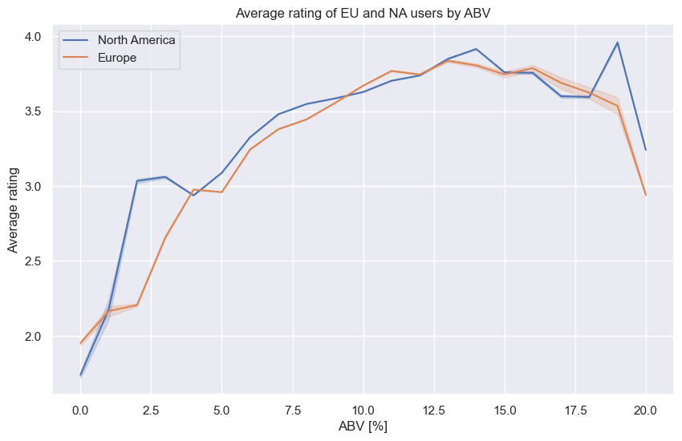

# Naive Analysis

We start by doing a simple analysis to see if there are some obvious differences between the two continents.
Moving straightforward to our research question!

### Do Americans prefer beers with higher alcohol content (ABV) than Europeans?

---
"Preference" can be a vague term, so let's try to look at the most common way of knowing if something is well liked or not: ratings!
We first investigate the average rating that Europeans and North American users give for each (rounded) ABV:

**Observation:**
  - It seems like NA users tend to give slightly better ratings in general, but we don't see a large difference.
  - Ratings are higher for beers with higher ABV up to a certain point (15%), but then starts to drop for both continents.
  - It's hard to draw a conclusion from those ratings only!

---

Because preference in beer may not only determined by the ratings, we now take a look at the difference in consumption between North America and Europe.
More precisely, we will look at the distribution of the ABV in the ratings coming from North America and Europe.

**Observation:**
  - The distribution is shifted towards higher ABV values, so the beers rated in North America have higher ABV than in Europe!
  - In contrast to the previous observation, this time, the difference is very clear.

Now, we could argue that even "beer" can be quite vague: what about all the different styles ? Now a question naturally arises:

### Could there be a correlation between the preferences and specific beer styles known for higher ABV?

Let's investigate: [Beer Styles](/ada-welovepandas-webpage/Beer%20styles)
