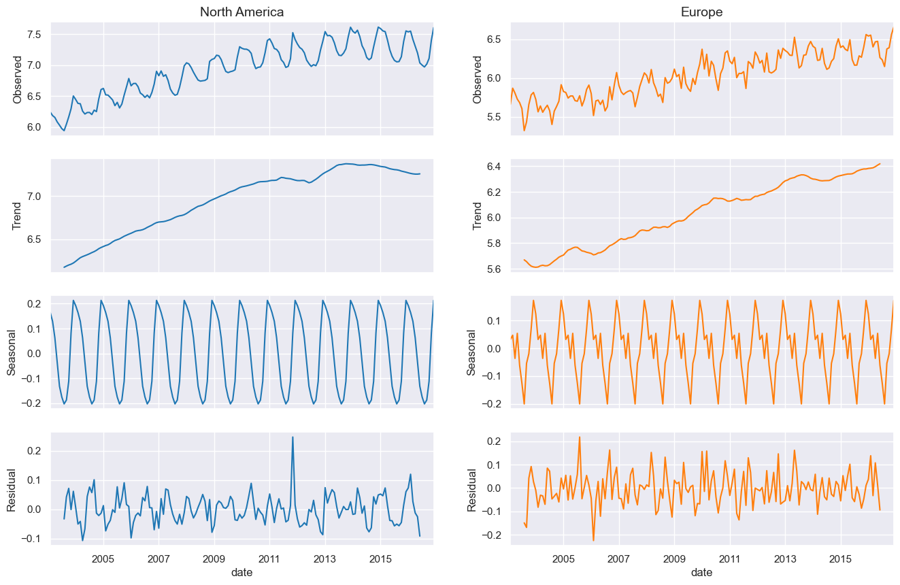
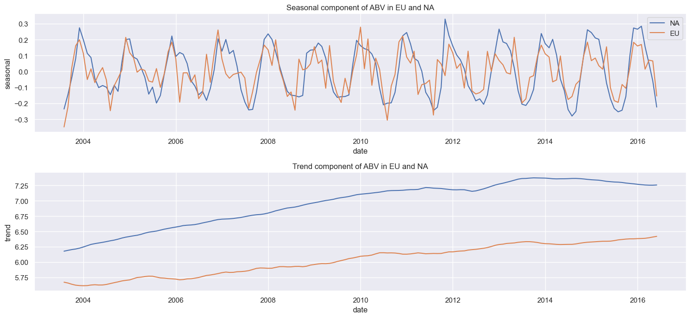
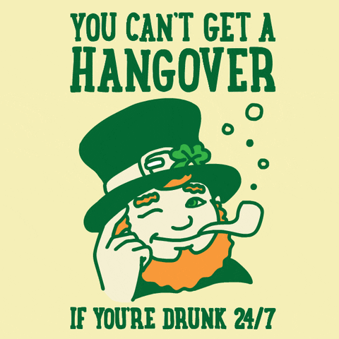
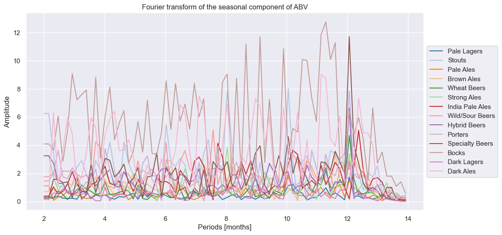
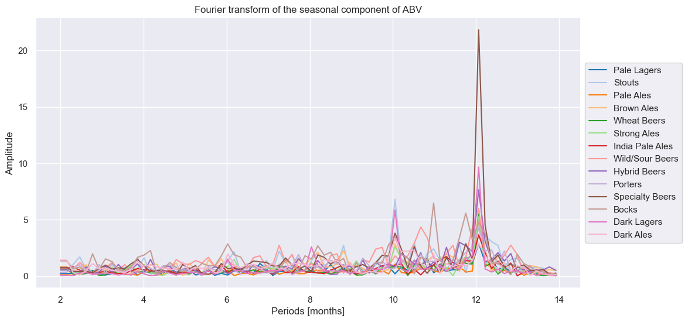
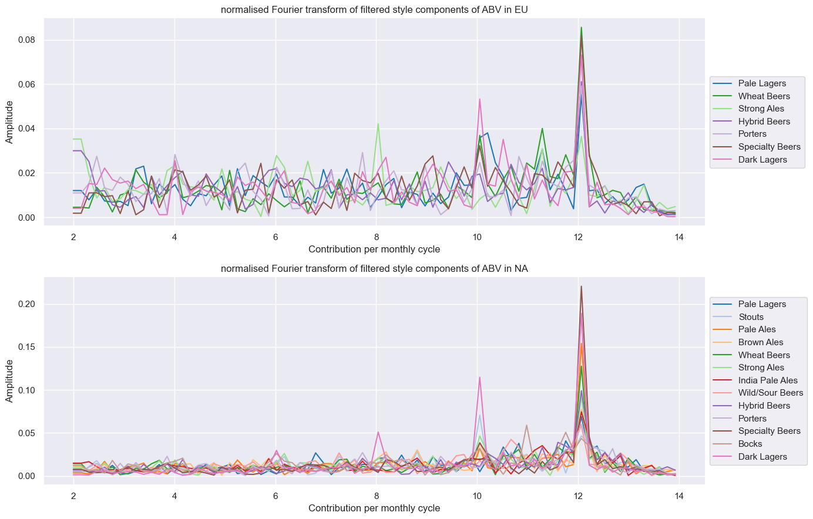
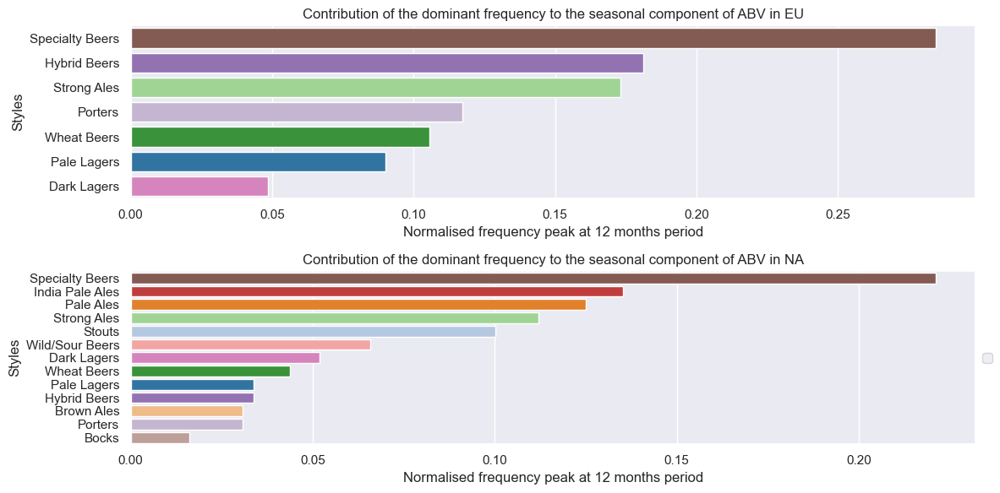
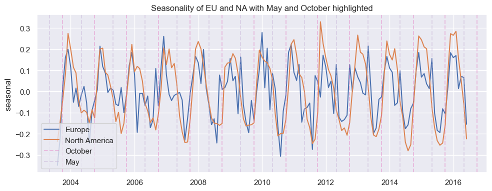

# Seasonality

---

## Why is there a seasonality trend between Europe and North America?

We will try to answer this question by first decomposing the time series for each region into seasonality and trend.

From the graph above, we can conclude the following points:

- **Observation:** Both regions show a clear seasonality pattern. However, in Europe, there is more noise present, and there is a second peak, which seems to appear in spring. What could be the reason for this?
- **Trend:** The trend seems to be linearly increasing for both continents, even though it is clearly higher for NA users.

---

### Question: What are the suspects which are the reason for seasonality?

### Oktoberfest Suspect 1

We suspect that the difference in the seasonality pattern of American and European ratings might be due to significant beer events that take place in Europe, such as **Oktoberfest**, which is, in fact, the world's largest beer festival and takes place in late September and the first weekend of October.

To be sure, we will take a closer look at the trend and the seasonality (including residuals):

_When keeping the residuals, the second peak in Europe looks more like a plateau, where North America seems to drop more quickly._

### St. Patrick's Day Suspect 2

    

        <b>Have you ever heard of St. Patrick's Day?</b>
          
        - It is an Irish traditional holiday, taking place in March.
        This might be the reason for the second peak appearing in spring!
    

    

        
    

 

### Let's address both of the _suspects_

The seasonal component, particularly its phases, is crucial. Employing Fourier Analysis, we perform a Fourier transform to extract the mode corresponding to the annual cycle. Given the monthly data, this corresponds to a periodicity of 12 months (after frequency transformation).

Assessing all beer styles along with their phases enables us to identify which styles contribute to seasonality and during which phase (time of the year).

Fourier analysis for **Europe**:

Fourier analysis for **North America**:

 

- **Observation:**
  - EU data is overall much noisier, which we already expected in the initial seasonality plot, this leads (since we normalised to 1) to reduced peaks, which does not matter here, but this normalisation allows to filter the very noisy data out that does not have a main peak in a yearly cycle

  - We clearly see that only few styles contribute to seasonality, hence this motivates to filter those styles that do not show significant differences at 12 months period

  - Interestingly, there are beers like e.g. **Dark Lagers** that show some mode at 10 months but not (or only marginal) at 12 months.

It makes sense to filter out all beer styles that do not seem to contribute to annual periodicity.

- **Observation:**
The FT-plots look much cleaner already now that only significant contributors to annual periodicity remain:
  - We still see some additional modes, that we do not further investigate here (because we are mainly interested in annual cycle), notably in Northern America with Dark Lagers at 8-, and 10-month cycles.
  - There seem to be more beers in NA with significant seasonality than EU
  - Considering the normalised FT values allowed us to consider e.g. Pale Lagers as well, even though the amplitude is small at 12 months, it stands out significantly compared to any other mode due to very low noise in the data.

In a next step we want to properly summarise and display our findings, also combining the phase information as well. We start by creating new data frame's that contain all FFT data points of all styles for Europe and North America.

This is already quite interesting - note though that we did the approximation that only the here considered beer styles contribute to seasonality at all (which is reasonable though when we consider the peaks below the chosen threshold as residual noise)!

- **Observation:**
  - Specialty beer contributes the most to seasonality, due to it's huge seasonal effect

  - Beers such as IPA show remarkable contribution to seasonality in North America, even though they do not show a very high seasonal mode, but the huge weight due to its popularity (reflected in # of reviews) even a marginal seasonality can contribute a lot to the total (we observe similar effects in Pale Lagers f.e.)

  - We observe that it's similar styles contribute to seasonality in EU and NA, even though fewer in EU overall

  - Also it's not the same order of contribution in EU and NA, wheat beers or Hybrids contribute much more in EU than in NA for example

An important factor is missing here: **The phase**. We do not see yet which contribution peaks in ABV at what time of year!

To present the final result of seasonality, we intend to summarise all findings in one plot.

<iframe width="800" height="600" frameborder="0" seamless="seamless" scrolling="no" src="./plots/html/peak_seasonality.html"></iframe>

- **Observation:**
  - $\approx$ 80% of the seasonal contribution in North America are peaking in the winter months (Dec.-Feb.), in the EU it's only around 65%. As we see, North America in most years has a higher winterly peak than Europe and does not flatten down as quickly as Europe, since we multiple styles contributing to higher ABV until February;

  - We observe **the effect of Oktoberfest**! Each year in October we see a peak contribution from Dark Lagers, which contain typical Oktoberfest beers such as Märzen. This however is hardly visible in the annual pattern because we're in transition from lower summer ABV towards higher Winter, and the contribution is only $\approx 5$%;

  - Europe has a second peak in May, where we see sort of a second small peaking or sort of a Plateau that we do not observe in North America. This seems to be due to Porters and Strong Ales contributing $\approx$ 28% of EU's seasonality, whereas this effect is marginal in North America with 13% from stouts in May and Porters in June;

  - It seems this is the main culprit that accounts for the quite different seasonality pattern in Europe.

To recall the initial seasonality we plot it once more here and highlight the off-peak contributions from Porters (EU only) and Dark Lagers.

- **Observation:**
  - EU shows a clear plateau each May.

  - Oktoberfest is barely noticeable here.

  - North America often holds the peak value longer, due to styles peaking their contribution in February as well.

#### So regarding all the above we can release the suspects for now.
