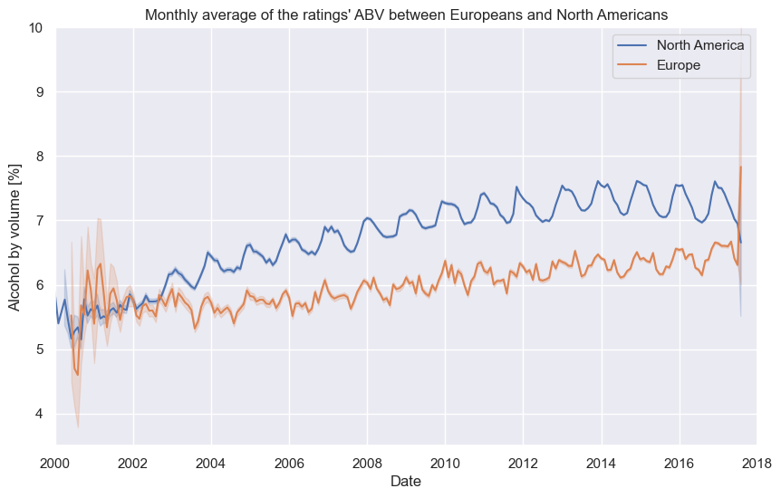
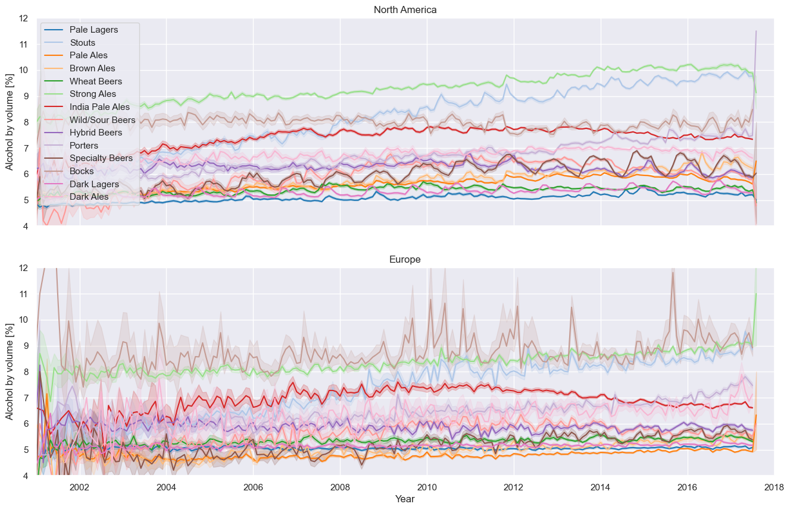

# Evolution over Time

---

Diving deeper into this data made us question if the preference for beers with higher ABV has increased over time.

## Do Americans or Europeans prefer beers with higher alcohol content as time goes by?

Let's explore this through the following plot:

> _Indeed, it appears to be true! There is a subtle evolution of ABV over time!_

---

_The graph clearly indicates that, on average, North American consumers tend to enjoy stronger beers compared to Europeans._

---

But that's not all! We've uncovered another intriguing observation!

---

Look at the shape of the time series – it seems periodic!

> This insight into the seasonality of this magical drink is more noticeable for North Americans. ABV peaks every start of a new year and hits a low each summer on both continents.

---

## What about beer styles? Do they exhibit similar characteristics?

> _Surprisingly, the answer is yes! Some beer styles, such as Specialty Beers, show a seasonal trend._

---

But why is the shape of the time series different for European users? Why is it not as clear as for North American users?

> If you're curious to learn more, take a look at the [Seasonality](/ada-welovepandas-webpage/Seasonality).

---

*Note 1: The fluctuations present in the first few years are not relevant for observation. It is possible that the reason behind this noise is the very few users of both BeerAdvocate and RateBeer at the beginning of their existence. As the popularity of these websites grew and more users registered, the curve started to take its representative shape.*
