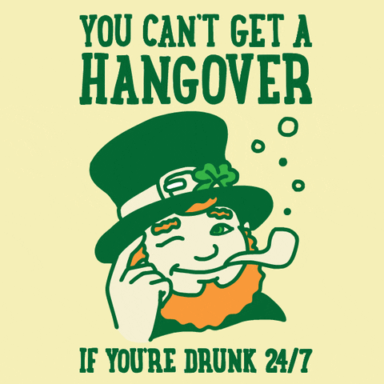

# Seasonality

---

## Why is there a seasonality trend between Europe and North America?

We will try to answer this question by first decomposing the time series for each region into seasonality and trend.

From the graph above, we can conclude the following points:

- Both regions show a clear seasonality pattern. However, in Europe, there is more noise present, and there is a second peak, which seems to appear in spring. What could be the reason for this?
- The trend seems to be linearly increasing for both continents with a similar slope. Although North America definitely shows higher ABV on average at all times!

---

### Question: What are the suspects which are the reason for seasonality?

### Oktoberfest Suspect 1

We suspect that the difference in the seasonality pattern of American and European ratings might be due to significant beer events that take place in Europe, such as **Oktoberfest**, which is, in fact, the world's largest beer festival and takes place in late September and the first weekend of October.

### Fresh and light during Summertime Suspect 2

Have you ever relaxed at a beach in summer, with your sun glasses on, sipping gently on your 12% Russian Imperial stout? Yes... Me neither. We suspect that people tend to drink lighter beers overall during hot summer days and rather prefer stronger kinds of beer during the colder parts of the year. This does not seem too unlikely, given that the seasonality pattern in both continents show higher ABV during winter periods on average than during summer!

To be sure, we will take a closer look at the trend and the seasonality (including residuals):

_When keeping the residuals, the second peak in Europe looks more like a plateau during springtime, where North America seems to drop more quickly._ 

### St. Patrick's Day Suspect 3

    

        <b>Have you ever heard of St. Patrick's Day?</b>
          
        - It is an Irish traditional holiday, taking place in March.
        This might be the reason for the second peak appearing in spring!
    

    

        
    

Since Guinness, and stouts in general, are rather on the strong side of beer spectrum, an increase in consumption could easily spark a peak in the ABV pattern.

In very a simple approach to investigate this, we decided to decompose the seasonality of each beer style into Fourier modes by running a simple discrete Fourier transform over it. Naturally converting from frequency space to periodicity space allows to easily filter beer styles that show a significant mode corresponding to a 12-month period. Comparing the amplitudes, and accounting in the popularity of the beer style in addition to extracting the phase shift of the peaks allows us to gain deeper insight on what the seasonality is composed of. The result is shown below
 

<iframe width="800" height="600" frameborder="0" seamless="seamless" scrolling="no" src="./plots/html/peak_seasonality.html"></iframe>

 

There are a few observations we make from this:
- Multiple beer styles show seasonal variation, most notably in both continents are... specialty beers.. They are truly special
- In both continents, as we suspected early on, a lot of styles contribute to seasonality with peak ABV values in Winter. This accounts for a whopping $\sim 80$% of the seasonality in North America and around $65$% in Europe.
- We even can confirm our first suspect! **Oktoberfest** shows its face (or peak) on both continents each October in the form of a contribution from Dark Lagers, which contains among others **Märzen** as well as **Oktoberfestbeer**! Although the overall contribution to the total is only $\sim 5$
- We also observe styles such as IPA, which showed marginal seasonality overall to have a larger contribution in America and pretty much none in Europe. We can recall here that due to the huge popularity in North America, even a slight seasonal change in ABV can have a strong overall effect if enough people drink (and rate) it.
- To our disappointment, St. Patricksday could not be confirmed. We observe the second peak in May, which is too late, and in the form of **Strong Ales** and **Porters** which peak only in Europe each year, a group of rather strong beers seems to gain popularity each May of every year. 

**Note:** Maybe looking at the seasonality of beer styles will help us understand its cause better? -> [Beer style seasonality](/ada-welovepandas-webpage/Beer%20style%20seasonality)
